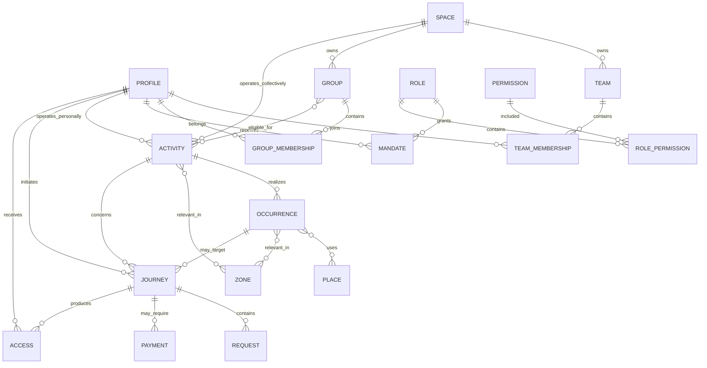

# Makolo — Domain Blueprint

> **Statut : canonique pour la cible d'architecture.** Ce document fixe les concepts, frontières et invariants qui doivent guider les prochaines migrations. Il ne décrit pas un schéma Django déjà implémenté et ne remplace pas les contrats de sécurité existants tant que les migrations correspondantes ne sont pas terminées.

## 1. Vision et contraintes

Makolo a d'abord été construit comme une plateforme événementielle multi-organisateurs, avec `Event`, `TicketType`, `TicketOrder` et `Ticket` au centre d'un socle déjà riche : organisations, paiements, scanner, CRM, promotions, automatisations et analytics.

La cible est plus large : **Makolo marche pour vous.** Le produit orchestre à distance les démarches qui imposeraient autrement un déplacement physique inutile, afin que l'utilisateur se déplace idéalement seulement lorsque sa présence devient réellement nécessaire.

Cela couvre notamment un concert, une conférence, une cérémonie, une inscription, une réservation, une invitation et, à terme, un trajet. Le paiement est une capacité utilisable par une Démarche, pas la finalité du produit.

Deux règles structurent la cible :

1. **backend générique, métier contextuel** : le noyau peut parler d'Activité, Occurrence, Démarche et Accès ; l'interface doit continuer à parler de trajet, départ, billet, invitation, pass, séance ou réservation lorsque ces termes sont plus naturels ;
2. **temps et géographie sont des dimensions métier** : ils doivent permettre de répondre à des questions comme « demain », « près de moi », « au départ de », « à cette séance » ou « dans cette zone », et pas seulement décorer une fiche.

La migration doit réutiliser les capacités existantes, préserver les frontières de sécurité déjà construites et éviter un « big bang ». `Event` et `Ticket` deviennent progressivement une verticale et des représentations spécialisées du nouveau noyau ; ils ne doivent plus dicter toutes les relations transversales.

---

## 2. Nomenclature canonique

| Concept | Définition canonique | Usage interface |
|---|---|---|
| **Profil** | Personne physique disposant d'un compte Makolo. L'identité est globale ; ses responsabilités ne le sont pas. Un Profil peut opérer directement une Activité personnelle sans créer d'Espace artificiel. | « Profil », « compte », nom de la personne selon l'écran. Ne jamais qualifier globalement un Profil de participant ou organisateur. |
| **Espace** | Identité collective opérée dans Makolo : entreprise, association, institution, marque, collectif, école, organisation publique, etc. Un Espace n'a pas de mot de passe. | « Espace » dans les surfaces génériques ; nom et vocabulaire métier de l'organisation ailleurs. Ne pas employer « Page » comme concept canonique. |
| **Équipe** | Ensemble de Profils qui travaillent pour un Espace ou une Activité. L'Équipe organise la collaboration ; l'autorité effective est exprimée par des Mandats. | « Équipe », « collaborateurs », « agents » selon le contexte. |
| **Groupe** | Ensemble de Profils réunis pour appartenance, ciblage ou éligibilité, sans autorité implicite : Promotion 2026, VIP, employés, famille, presse, etc. | « Groupe », « promotion », « liste VIP », « employés » selon le métier. |
| **Rôle** | Ensemble lisible et réutilisable de Permissions. | Administrateur, Responsable financier, Responsable accès, etc. |
| **Permission** | Capacité atomique, stable et testable : gérer une activité, voir les paiements, valider une demande, gérer une équipe, contrôler un accès. | Généralement invisible comme objet ; exprimée via rôles et messages d'autorisation. |
| **Mandat** | Attribution d'un Rôle à un Profil dans une portée déterminée, éventuellement limitée dans le temps. Formule : `Profil + Rôle + Portée = Mandat`. | Présenté comme responsabilité/accès/role dans un Espace ou une Activité. |
| **Confiance** | Domaine des mécanismes d'identité, sécurité, preuve et assurance utilisés par Makolo. | « Sécurité », « confiance », « vérification » selon l'écran. |
| **Vérification** | Processus/constat contrôlé confirmant une information : Profil, Espace, autorité d'un administrateur, information de paiement, etc. | « Vérifié par Makolo » lorsque la portée est explicite. Ne pas promettre une certification générale de qualité. |
| **Activité** | Chose organisée, proposée ou opérée : concert, conférence, mariage, trajet, formation, séance ou autre service. Porte l'identité durable et les règles communes, pas toutes les données spécifiques d'une verticale. Son opérateur logique est exactement un Profil ou un Espace. | Toujours contextualiser lorsque possible : concert, trajet, conférence, cérémonie… |
| **Occurrence** | Réalisation concrète d'une Activité dans le temps et éventuellement dans un Lieu. | Départ, séance, session, cérémonie, créneau… Le mot « occurrence » peut rester interne. |
| **Démarche** | Processus utilisateur orchestré par Makolo : achat, commande, réservation, inscription, invitation, demande de participation ou combinaison d'étapes. | Utiliser réservation, inscription, commande, invitation, demande… |
| **Demande** | Objet décisionnel dans une Démarche lorsqu'une validation humaine ou automatique est nécessaire. | Demande d'inscription, de réservation, de participation… |
| **Accès** | Droit individuel acquis permettant à un Profil d'effectuer ou de recevoir ce qui a été accordé : embarquer, entrer, participer, accéder. | Billet, ticket, invitation, pass, badge, confirmation… selon le métier. |
| **Lieu** | Emplacement physique précis : salle, agence, gare, point d'embarquement, bureau, rendez-vous. | Nom du lieu ou rôle métier : « point d'embarquement », « salle ». |
| **Zone** | Périmètre géographique : quartier, ville, province, campus, rayon, polygone métier. | Ville, zone desservie, secteur, rayon… |

### Concept interne vs vocabulaire métier

Les concepts **Activité**, **Occurrence**, **Démarche** et **Accès** sont d'abord des abstractions backend et d'architecture. Ils ne constituent pas un glossaire imposé à l'utilisateur. La couche de présentation choisit le vocabulaire de la verticale.

Exemple : une `Access` issue d'une `Journey` liée à une `Occurrence` de transport peut être présentée comme un **billet de voyage** pour un **départ**, tandis que la même abstraction dans un mariage peut être une **invitation** pour une **cérémonie**.

---

## 3. Entités centrales et responsabilités

### Profil

**Responsabilité** : identité personnelle Makolo, authentification, préférences personnelles et sécurité du compte.

**Possède** : identité de connexion, informations personnelles, préférences, appareils/sessions, liens vers vérifications personnelles et, lorsque la personne agit en son nom, Activities personnelles dont il est l'opérateur logique.

**Ne possède pas** : un rôle métier global « organisateur », « finance » ou « scanner ». Les flags historiques de ce type sont des compatibilités à retirer progressivement.

**Cycle essentiel** : création → vérifications éventuelles → actif/verrouillé/désactivé → anonymisation/suppression selon les règles futures.

**Relations** : Équipes, Groupes, Mandats, Activités personnelles, Démarches, Accès, Vérifications.

### Espace

**Responsabilité** : identité collective et opérateur logique des activités/capacités métier d'une entité collective lorsqu'elle agit dans Makolo.

**Possède** : identité publique, paramètres, équipes, activités qu'il opère, groupes internes, configuration métier, vérifications propres à l'entité.

**Ne possède pas** : des identifiants d'authentification humains ; un Espace n'est jamais un `User` déguisé et ne doit pas être fabriqué pour représenter le contexte personnel d'un Profil.

**Cycle essentiel** : création → configuration → vérification éventuelle → actif → suspendu/archivé.

**Relations** : Profils via Équipes/Mandats, Activités, Groupes, CRM, promotions, analytics.

### Équipe

**Responsabilité** : représenter la collaboration opérationnelle d'un Espace ou d'une Activité.

**Possède** : nom, portée de collaboration, membres, état, éventuellement des rôles suggérés/autorisés pour l'UI.

**Ne possède pas** : une autorisation implicite universelle. La source de vérité des capacités reste le Mandat.

**Cycle essentiel** : création → membres actifs → réorganisation/archivage.

**Relation recommandée** : l'ajout d'un membre avec un rôle dans l'UI crée/maintient transactionnellement une `TeamMembership` et le ou les Mandats correspondants. Cela permet une UX simple sans confondre appartenance et autorité.

### Groupe

**Responsabilité** : appartenance, ciblage et éligibilité.

**Possède** : membres, règles/sources éventuelles, métadonnées de ciblage.

**Ne possède pas** : des Permissions ou une autorité d'administration par défaut.

**Cycle essentiel** : création → population manuelle/dynamique → utilisation pour ciblage/éligibilité → archivage.

### Rôle et Permission

**Permission** est la brique atomique et stable. **Rôle** regroupe plusieurs Permissions sous un nom lisible. Les rôles système couvrent les besoins usuels ; des rôles personnalisés pourront venir plus tard sans modifier la sémantique des permissions.

Un Rôle ne donne aucun droit seul : il doit être porté par un Mandat.

### Mandat

**Responsabilité** : source d'autorité contextuelle.

**Possède** : Profil, Rôle, portée explicite, validité temporelle, état, provenance/audit.

**Ne possède pas** : une cible polymorphe opaque ou une cascade implicite non documentée.

Portées minimales :

- plateforme Makolo ;
- Espace ;
- Activité ;
- Groupe.

Les règles de résolution doivent être explicites : un Mandat Espace peut donner les capacités déclarées sur les Activités de cet Espace uniquement lorsque la Permission le prévoit ; un Mandat Activité est plus local et ne doit jamais élargir l'accès à tout l'Espace.

### Confiance et Vérification

**Confiance** est le bounded context ; **Vérification** est le processus/constat.

La cible doit permettre au moins des vérifications de Profil, d'Espace et d'autorité administrative sans faire croire qu'une marque « Vérifié par Makolo » garantit les produits ou services de l'entité.

Les preuves, décisions de revue, reviewer, dates et portée de la vérification doivent être auditables. Les documents sensibles ne doivent pas devenir des métadonnées génériques.

### Activité

**Responsabilité** : identité durable et règles communes de ce qui est proposé/opéré.

**Possède** : un opérateur logique explicite — **Profil ou Espace, jamais les deux** — ainsi que titre/description, visibilité, catégorie/taxonomie transversale, état, règles communes et éventuellement zones de pertinence. La provenance `created_by` reste distincte : elle indique quel Profil humain a créé l'objet, y compris lorsqu'il agit au nom d'un Espace.

**Ne possède pas** : les champs spécifiques de toutes les verticales, ni nécessairement une date unique, un lieu unique, une origine/destination ou une tarification. La propriété logique n'accorde pas directement une Permission : l'autorité d'administration reste exprimée par les Mandats.

Les données événementielles ou transport sont ajoutées par **composition** dans les verticales spécialisées.

### Occurrence

**Responsabilité** : matérialiser l'exécution temporelle d'une Activité.

**Possède** : fenêtre de début/fin, timezone, état opérationnel, lieux/points nécessaires, capacité/allocation lorsqu'elle est propre à l'exécution.

**Ne possède pas** : l'identité éditoriale durable de l'Activité ni tous les paramètres commerciaux.

Une Activité peut avoir 0..n Occurrences. Une Activité sans occurrence publiée peut rester un brouillon ou un service dont le créneau sera créé ultérieurement.

### Démarche

**Responsabilité** : instance du processus suivi pour un Profil et une Activité/Occurrence.

**Possède** : initiateur/bénéficiaire, workflow choisi, état courant, timestamps, contexte sélectionné, lien vers Demandes, Order éventuel, Paiements et résultat(s) d'Accès.

**Ne possède pas** : une forêt de booléens `is_paid`, `is_invited`, `is_approved`. L'état vient d'un workflow et les sous-domaines (paiement, demande, accès) conservent leurs propres états.

### Demande

**Responsabilité** : décision explicite nécessaire à une Démarche.

**Possède** : type/motif, état, auteur, décideur, décision, timestamps et données structurées nécessaires à la décision.

**Ne possède pas** : le workflow complet ni le paiement.

### Accès

**Responsabilité** : droit individuel final ou actif.

**Possède** : bénéficiaire, portée (Activité/Occurrence), état, période de validité, règles d'utilisation, origine de délivrance, transferts éventuels.

**Ne possède pas** : le QR/PDF comme identité du droit. Les représentations sont séparées.

**Cycle essentiel** : préparé/émis → valide → utilisé partiellement ou totalement selon politique → expiré/annulé/révoqué/transféré.

### Lieu et Zone

**Lieu** est un point/emplacement physique précis et réutilisable. **Zone** est un périmètre. Aucun des deux ne doit absorber les concepts métier de trajet.

Une origine, destination ou étape de transport est une relation métier vers un Lieu, pas un nouveau type global de Lieu. Une « zone desservie » est une relation métier vers une Zone.

---

## 4. Relations et cardinalités



### Relations obligatoirement explicites

- **Profil ↔ Espace** : pas de M2M directe comme source d'autorité. Le lien de travail passe par Équipe/TeamMembership ; les pouvoirs passent par Mandat.
- **Profil ↔ Équipe** : M:N via `TeamMembership`, afin de conserver dates, état, invitation et audit.
- **Profil ↔ Groupe** : M:N via `GroupMembership`, afin de conserver source, validité et état.
- **Profil ↔ Mandat** : 1:N ; plusieurs responsabilités peuvent coexister sur des portées différentes.
- **Mandat ↔ Rôle** : N:1 ; **Rôle ↔ Permission** : M:N via un modèle `RolePermission` explicite.
- **Profil/Espace ↔ Activité** : une Activity possède exactement un opérateur logique principal : `owner_profile` **XOR** `space`. Le Profil est utilisé lorsque la personne agit en son nom ; l'Espace lorsqu'elle agit pour une identité collective. Une collaboration multi-Espaces future doit passer par un modèle de relation distinct sans rendre cet ownership ambigu. `created_by` reste une relation de provenance vers le Profil humain et ne remplace jamais cette propriété métier.
- **Activité ↔ Occurrence** : 1:N.
- **Occurrence ↔ Lieu** : M:N via un modèle intermédiaire lorsque plusieurs rôles de lieux sont nécessaires ; sinon une FK explicite suffit pour un rôle unique d'une verticale.
- **Activité/Occurrence ↔ Zone** : via modèles intermédiaires lorsque la relation porte un sens (découverte, desserte, éligibilité, restriction).
- **Profil ↔ Démarche** : 1:N comme initiateur et/ou bénéficiaire explicite.
- **Démarche ↔ Demande** : 1:N.
- **Démarche ↔ Paiement** : 1:N ; une Démarche peut ne nécessiter aucun paiement, ou plusieurs tentatives.
- **Démarche → Accès** : 0..N ; certains workflows s'arrêtent sans accès, d'autres produisent un ou plusieurs droits individuels.
- **Groupe → éligibilité collective → Accès individuels** : un Groupe peut rendre ses membres éligibles, mais chaque droit délivré reste un `Access` individuel lié à un Profil.

---

## 5. Frontières de domaine Django

La cible doit rester modulaire sans créer une app par nom du glossaire.
| Bounded context / app recommandée | Responsabilité cible | Stratégie avec l'existant |
|---|---|---|
| `accounts` | Profil, authentification, préférences, sessions/appareils | Conserver le custom `User` comme identité technique. Retirer progressivement rôles métier globaux/flags historiques. |
| `organizations` | Espace et Équipes | Conserver `Organization` techniquement pendant la migration ; le frontend et la doc domaine parlent d'Espace. Ajouter les concepts d'équipe ici lorsque la migration commence. |
| `authorization` | Permission, Rôle, RolePermission, Mandat, résolution d'autorité | Nouvelle frontière dédiée. Migrer progressivement `accounts.Role`, `PermissionGroup`, `OrganizationRole` et les checks statiques vers ce noyau. |
| `groups` | Groupes, memberships et éligibilités collectives | Nouvelle app car le Groupe n'est ni CRM Audience ni Équipe. Les audiences CRM peuvent consommer les Groupes sans en être la source de vérité. |
| `trust` | Vérifications de Profil/Espace/autorité et preuves | Nouvelle app lorsque la migration Trust commence ; récupérer les responsabilités de `VerificationDocument` et `OrganizationVerificationStatus` sans GFK opaque. |
| `geography` | Lieu, Zone, géométrie, géocodage abstrait | Nouvelle app. Fournit des objets géographiques réutilisables aux autres domaines. |
| `activities` | Activité, Occurrence, taxonomie commune, relations communes vers lieux/zones | Nouveau noyau transversal. |
| `journeys` | Démarche, Demande, workflow contrôlé et transitions | Nouvelle app. Ne doit pas absorber Payment ni Access. |
| `access` | Accès, credential/représentation, utilisation/validation, transfert, points de contrôle | Nouvelle app issue de la généralisation de `tickets.Ticket` et du scanner. |
| `commerce` | Offre, lignes de commande/snapshots commerciaux, capacité/réservation de stock | Nouvelle frontière lorsque `TicketType`/`TicketOrder` sont généralisés. Ne pas y déplacer le provider de paiement. |
| `payments` | Paiements, refunds, événements provider, idempotence | Conserver l'app, remplacer à terme sa dépendance obligatoire à `TicketOrder` par une relation au commerce/Démarche explicite. |
| `events` | **Verticale événementielle** : données spécifiques concerts/conférences/cérémonies | Conserver l'app comme spécialisation par composition au-dessus d'Activity/Occurrence. |
| `transport` | **Verticale transport** : route, origine/destination, arrêts, classe/service, contraintes transport | Nouvelle app seulement au moment du Transport MVP. |
| `notifications`, `crm`, `promotions`, `automation`, `analytics_app`, `growth`, `partners`, `loyalty` | Capacités transversales | Généraliser progressivement leurs références d'Event/Ticket vers Space/Activity/Occurrence/Journey/Access/Offer selon le sens métier. |

### Choix clé : conserver `Organization` techniquement au début

Renommer une table/modèle mature n'apporte pas à lui seul la nouvelle architecture. La recommandation est de **faire d'abord évoluer les responsabilités et relations**, tout en présentant le concept comme Espace. Un renommage Python/table pourra être décidé plus tard si son bénéfice dépasse son coût de migration.

### Choix clé : `events` devient une verticale

`events` ne disparaît pas. Il cesse d'être le noyau transversal. Une future composition de type `EventDetails(activity=OneToOneField(Activity))` est préférable à une sous-classe multi-table `Event(Activity)` et à une `Activity` géante remplie de colonnes événement/transport nullables.

---

## 6. Stratégie de relations Django

### ForeignKey

Utiliser une `ForeignKey` lorsqu'une entité appartient naturellement à une autre ou lorsqu'une relation N:1 possède une sémantique stable : Occurrence → Activity, Activity → Space opérateur **ou** Activity → Profile opérateur personnel, Access → Profile bénéficiaire.

Pour l'ownership Activity, deux FKs explicites et une contrainte XOR sont préférables à `ContentType`, `GenericForeignKey` ou un propriétaire polymorphe opaque. `created_by` est une FK séparée de provenance/audit.

`PROTECT`, `SET_NULL` ou `CASCADE` doivent refléter la rétention métier, pas une convention globale. Les droits, paiements, décisions et audits historiques doivent généralement survivre à la suppression logique de leur contexte.

### OneToOneField

Utiliser `OneToOneField` pour la **composition spécialisée** : par exemple EventDetails ↔ Activity ou un détail métier unique ↔ Activity. C'est la stratégie recommandée pour les verticales.

Ne pas utiliser l'héritage multi-table Django pour modéliser les verticales.

### ManyToManyField

Une M2M directe est acceptable uniquement lorsque la relation n'a réellement aucun état, date, rôle, provenance ni règle future.

Dès qu'une relation porte du sens métier, préférer un `through` explicite.

### Modèles `through`

Ils sont la norme pour :

- TeamMembership ;
- GroupMembership ;
- RolePermission ;
- éligibilité Groupe–Activité/Offre ;
- relations Activity/Occurrence–Place/Zone avec rôle ;
- collaborations éventuelles entre Espaces et Activités.

### Modèles abstraits

Les modèles abstraits sont réservés aux préoccupations structurelles : UUID, timestamps, audit basique, champs de statut communs lorsque la sémantique est réellement identique.
Ne pas créer une classe abstraite « BookableThing » ou « GenericProcess » qui masque des cycles de vie différents.

### Héritage vs composition

**Recommandation : composition.** Les verticales référencent le noyau en `OneToOne`/`ForeignKey`. Cela garde les contraintes explicites et évite une hiérarchie fragile.

### ContentType / GenericForeignKey

**Ne pas utiliser `ContentType` pour rendre Makolo artificiellement générique.**

Interdit comme fondation pour :

- portée des Mandats ;
- cible d'un Accès ;
- appartenance de Groupe ;
- bénéficiaire de Démarche ;
- paiement ;
- spécialisation Activity ;
- ownership.

Pour les Mandats, la recommandation principale est un modèle avec **portées explicites** : type de portée contrôlé et FKs nullable vers Espace/Activité/Groupe, complétés par une contrainte garantissant exactement la forme attendue (aucune FK pour plateforme, une seule FK pour une portée locale). Cela maintient l'intégrité référentielle sans multiplier quatre tables de Mandats.

`ContentType` peut rester pertinent pour des fonctionnalités réellement ouvertes comme un audit technique générique ou une notification capable de pointer vers de nouveaux types d'objets sans changer leur intégrité métier. Même dans ces cas, l'objet métier source reste explicite.

---

## 7. Modèles intermédiaires attendus

Les noms Python pourront évoluer, mais les responsabilités suivantes doivent exister.

### TeamMembership

Lie `Profile` à `Team` avec : état, dates, invité par, dates de validité éventuelles. La TeamMembership n'est pas la permission elle-même.

### GroupMembership

Lie `Profile` à `Group` avec : source, état, dates et éventuellement période d'éligibilité.

### Mandate

Lie `Profile` + `Role` + portée explicite. Porte `valid_from`, `valid_until`, état, accordeur et audit. Une contrainte empêche une portée incohérente.

### RolePermission

Lie `Role` + `Permission`, avec éventuellement une valeur système/personnalisée. Les permissions atomiques ont des codes stables versionnés par le code applicatif.

### ActivityOwnership / collaboration

L'ownership principal d'une Activity est explicite : `Activity.space` pour un opérateur collectif **ou** `Activity.owner_profile` pour un opérateur personnel, avec contrainte XOR pour les nouvelles lignes. `Activity.created_by` reste indépendant et conserve le Profil humain à l'origine de la création. Les données historiques antérieures dont l'ownership n'est pas déterminable automatiquement peuvent rester temporairement non résolues pendant une migration additive plutôt que d'être attribuées arbitrairement.

Si les co-organisations deviennent un besoin réel, ajouter un modèle `ActivitySpaceRole`/équivalent avec un rôle explicite (co-organisateur, sponsor opérateur, partenaire), sans rendre l'ownership principal M2M.

La propriété personnelle n'est pas une permission implicite. La création d'une Activity personnelle doit attribuer transactionnellement le Mandat Activity approprié au Profil propriétaire ; la délégation à d'autres Profils continue ensuite à passer par des Mandats Activity.

### GroupEligibility

Lie un Groupe à une Activité, une Occurrence ou une Offre selon la règle d'éligibilité. Préférer des modèles explicites par niveau si les règles divergent plutôt qu'un GFK.

Une éligibilité ne crée pas automatiquement un droit partagé : le claim/approval crée des Accès individuels.

### OccurrencePlace
Modèle intermédiaire pour les usages communs où une occurrence a plusieurs lieux fonctionnels, avec `role`, ordre et fenêtre éventuelle. Les rôles génériques doivent rester peu nombreux.

Pour le transport, **origine/destination/étapes doivent vivre dans la verticale transport**, par exemple via `TransportStop`, car leur ordre et leur sémantique dépassent un simple label de lieu générique.

### ActivityZone / OccurrenceZone

Relations explicitant le sens (`discovery`, `service_area`, `restriction`, etc.) seulement si ce sens est réellement partagé. Une règle transport spécifique de desserte peut rester dans `transport`.

---

## 8. Permissions et autorité contextuelle

### Principe

**L'identité est globale ; l'autorité est contextuelle.** Toute autorisation doit répondre : **qui peut faire quoi, et où ?**

Le système actuel sépare déjà correctement `is_staff` des rôles d'organisation et protège les domaines sensibles par sélecteurs/permissions/services. Cette séparation doit être conservée et généralisée, pas simplifiée.

### Cible

1. **Staff Makolo** : capacités de plateforme, accordées explicitement via statut staff et/ou Mandats de portée plateforme selon la stratégie de migration. Les droits Django Admin restent distincts des rôles métier d'un Espace.
2. **Permissions Espace** : gestion de l'identité collective, équipe, finances globales, CRM, etc.
3. **Permissions Activité** : publication, configuration, billetterie/offres, validation de demandes, accès et opérations d'une Activité précise.
4. **Permissions Groupe** : gestion de membres/éligibilité d'un Groupe précis. Appartenir au Groupe ne donne aucun de ces droits.
5. **Mandats** : seule attribution métier canonique des rôles contextuels.

L'ownership `Activity.owner_profile` ou `Activity.space` ne constitue pas un raccourci autour de `can()`. Lorsqu'un Profil crée personnellement une Activity, son autorité locale est matérialisée par un Mandat Activity ; un manager délégué reçoit de même un Mandat Activity. TeamMembership ou GroupMembership seules ne donnent aucune capacité de gestion.

### Rôles standards

Makolo doit fournir des rôles système lisibles (Administrateur d'Espace, Responsable activité, Finance, Marketing, Responsable accès, Responsable inscriptions, etc.). Ils remplacent progressivement les `TextChoices` figés comme source d'autorité.

Les rôles personnalisés pourront être ajoutés plus tard en assemblant des Permissions autorisées dans une portée. Un rôle personnalisé ne doit jamais pouvoir s'octroyer une Permission plateforme interdite.

### Résolution

La permission doit être résolue par un service central d'autorisation, avec des fonctions lisibles du type :

```text
can(profile, "activity.manage", activity)
can(profile, "payments.view", space)
can(profile, "group.members.manage", group)
```

L'implémentation exacte viendra dans la migration. Les domaines continuent à utiliser leurs selectors/services pour filtrer les objets et appliquer les transitions.

### Séparation des données sensibles

La matrice actuelle Finance/Marketing/Event Manager/Scanner reste un minimum de sécurité. La généralisation ne doit pas donner à un rôle « activity.manage » accès par défaut aux références financières, PII CRM ou données de contrôle d'accès. Les Permissions restent fines par domaine.

### Compatibilité

Pendant la transition :

- `OrganizationMembership.role`, `User.is_organizer`, `User.is_scanner_agent` et les rôles globaux existants restent des adaptateurs de compatibilité ;
- les nouveaux contrôles doivent progressivement lire les Mandats ;
- une période de double-écriture/lecture compatible peut être utilisée ;
- les flags historiques ne doivent recevoir aucune nouvelle responsabilité.

---

## 9. Workflows de Démarche

Makolo doit offrir des **workflows configurables mais contrôlés**. L'Espace choisit parmi des modèles supportés et leurs paramètres ; il ne construit pas un automate arbitraire capable de contourner les invariants métier.

### États de Démarche recommandés

Le noyau peut utiliser un ensemble commun de statuts, dont chaque workflow n'active qu'un sous-ensemble :

- `draft` — sélection en préparation ;
- `submitted` — démarche soumise ;
- `pending_approval` — décision nécessaire ;
- `approved` — décision positive, prochaine étape possible ;
- `pending_payment` — paiement requis ;
- `confirmed` — conditions métier remplies ;
- `fulfilled` — résultat/Accès délivré et démarche accomplie ;
- `rejected` — décision négative ;
- `cancelled` — annulation volontaire/opérateur ;
- `expired` — fenêtre dépassée.

Ces statuts ne remplacent pas `PaymentStatus`, `RequestStatus` ou `AccessStatus`. Une transition de Démarche est déclenchée par des événements du sous-domaine et validée par un service.

### Demande

États recommandés : `pending`, `approved`, `rejected`, `cancelled`, `expired`. Une Démarche peut contenir zéro ou plusieurs Demandes, mais la première implémentation doit rester simple : une demande principale lorsque le workflow en nécessite une.

### Workflows initiaux

| Workflow | Transitions essentielles | Paiement | Demande | Résultat |
|---|---|---|---|---|
| **Achat immédiat** | draft → pending_payment → confirmed → fulfilled | Requis si montant > 0 | Non | Accès après paiement/confirmation |
| **Commande avec validation** | submitted → pending_approval → approved → pending_payment → confirmed → fulfilled | Après approbation si requis | Oui | Accès après conditions satisfaites |
| **Réservation sans paiement immédiat** | submitted → confirmed → fulfilled ou confirmed jusqu'au service | Non immédiat ; paiement sur place possible hors provider | Optionnelle | Confirmation/Accès selon politique |
| **Inscription gratuite** | submitted → confirmed → fulfilled | Non | Non | Accès/confirmation |
| **Inscription avec validation** | submitted → pending_approval → approved → confirmed → fulfilled | Non par défaut | Oui | Accès/confirmation |
| **Invitation** | submitted/invited → approved(acceptée) → confirmed → fulfilled | Non | Acceptation assimilée à décision contrôlée | Accès individuel |
| **Invitation puis paiement** | invited → approved → pending_payment → confirmed → fulfilled | Oui après acceptation | Oui/acceptation | Accès après paiement |
| **Paiement après approbation** | submitted → pending_approval → approved → pending_payment → confirmed → fulfilled | Oui après décision | Oui | Accès |
| **Paiement sur place** | submitted → confirmed → fulfilled | Aucun paiement provider requis avant confirmation ; le mode de règlement est une politique commerciale | Selon cas | Accès/confirmation conforme à la règle |

### Règles de transition

- transitions effectuées uniquement par des services de domaine, jamais par édition libre d'un champ `status` depuis une vue ;
- idempotence pour les événements externes (paiement/webhook, acceptation, validation) ;
- audit des décisions humaines ;
- expiration gérée par Autopilot lorsque le temps intervient ;
- un workflow définit ses transitions autorisées et préconditions ;
- les paramètres configurables restent bornés : « approbation requise », « paiement requis après approbation », délais, capacité, politique de délivrance, etc., sans moteur de règles arbitraire dans la première version.

---

## 10. Accès

### Le droit n'est pas sa représentation

`Access` est le droit. Un QR, PDF, billet imprimable, invitation visuelle ou badge est un **credential/représentation** du droit.

La cible doit séparer au minimum :

- `Access` — bénéficiaire, portée, état, validité et politique d'utilisation ;
- `AccessCredential` — jeton/format/rotation/révocation de la représentation ;
- `AccessUse` ou validation log — tentative/utilisation du droit, résultat, point de contrôle, opérateur ;
- `AccessTransfer` — transfert lorsqu'autorisé.

### États

États recommandés : `pending`, `valid`, `used`, `cancelled`, `revoked`, `expired`, `transferred`. Pour un accès multi-usage, `used` seul ne suffit pas : la politique peut définir un compteur/usage et l'état final devient consommé lorsque la limite est atteinte.

La première migration depuis Ticket peut conserver une politique **single-use** afin de préserver l'anti-double-scan actuel.

### Validation

La validation vérifie :

1. credential authentique et non révoqué ;
2. Access existant et valide ;
3. bonne Activity/Occurrence/point de contrôle ;
4. fenêtre temporelle ;
5. politique d'utilisation ;
6. idempotence du terminal ;
7. autorité du contrôleur.

Le log ne conserve pas le secret QR brut, conformément à la pratique existante.

### Annulation, expiration, transfert

- annuler/révoquer un Access invalide immédiatement ses credentials actifs ;
- expiration vient de la validité du droit, pas de la date d'un PDF ;
- un transfert accepté change le bénéficiaire et **fait tourner le credential** ;
- l'historique reste audit-able ;
- les remboursements et annulations de Démarche déclenchent les transitions Access appropriées via services.

### Droit collectif

Un Groupe peut être déclaré éligible, invité ou autorisé collectivement. Cela ne crée jamais un QR de Groupe. Lors du claim, de l'acceptation ou de l'émission, Makolo crée un Access **par Profil**. Cette individualisation est requise pour l'audit, la révocation, le transfert et l'anti-fraude.

### Migration de `Ticket`

`Ticket` est aujourd'hui à la fois droit, titulaire et source du QR. La migration doit d'abord créer/adosser un `Access` 1:1 à chaque Ticket existant, puis déplacer la validation vers Access/Credential. Le modèle Ticket peut ensuite devenir une représentation événementielle d'un Access, avant éventuelle réduction ou suppression technique.

---

## 11. Temps et lieu

### Activité vs Occurrence

Une Activité décrit **quoi** est proposé/opéré. Une Occurrence décrit **quand** cette activité se réalise et, lorsque pertinent, **où**.

Un concert peut avoir une date unique aujourd'hui mais plusieurs séances demain ; un trajet de ligne peut avoir de nombreux départs. Le noyau ne doit pas faire de l'heure de départ un champ obligatoire d'Activity.

### Lieu

La cible `Place` doit pouvoir évoluer vers GeoDjango : géométrie ponctuelle, adresse structurée, label, provenance et précision. Les données `EventVenue.latitude/longitude` actuelles pourront être migrées.

Un lieu en ligne n'est pas un Lieu physique. Les URLs de participation distante appartiennent à la configuration de l'Occurrence/verticale.

### Zone

Une `Zone` cible doit pouvoir représenter un polygone/multipolygone ou un rayon selon le besoin. Les relations métier indiquent pourquoi une Activité/Espace est liée à la Zone : découverte, desserte, restriction, éligibilité, etc.

### Origine, destination, étapes

Ces concepts sont **contextuels au transport**. La verticale transport doit utiliser une séquence explicite de stops vers `Place`, avec ordre, temps prévus et règles d'embarquement/descente. Ne pas ajouter `origin`, `destination`, `stop_1...` à Activity.

### Position utilisateur ponctuelle vs localisation déclarée

- la localisation déclarée du Profil (ville/adresse) est une préférence/identité et n'est pas une position temps réel ;
- une position « près de moi » est une donnée ponctuelle fournie par le client pour une requête de découverte ; elle ne doit pas être persistée par défaut ;
- si une fonctionnalité future nécessite un historique de localisation, elle devra faire l'objet d'une décision de confidentialité séparée.

### Cible technique géospatiale

Décision architecturale : **PostgreSQL + PostGIS + GeoDjango** pour les requêtes géospatiales de production, données OpenStreetMap et affichage MapLibre. Le géocodage est derrière une interface provider interchangeable.

Cette cible n'implique pas d'utiliser immédiatement un service public Nominatim en production. Nominatim public peut servir à des usages bêta compatibles avec sa politique, mais ne doit jamais devenir une dépendance architecturale.

---

## 12. Carte de migration de l'existant

| Concept actuel | Problème dans la cible | Cible | Action future |
|---|---|---|---|
| `User` | Porte identité **et** rôles/flags métier globaux historiques | Profil dans `accounts` | Conserver le custom User ; migrer autorité vers Mandats ; déprécier `roles`, `permission_groups`, `is_organizer`, `is_scanner_agent` comme sources métier. |
| `Organization` | Bon noyau collectif mais vocabulaire/autorité centrés « organisateur événementiel » | Espace | Conserver techniquement au début, élargir responsabilités et présentation. |
| `OrganizationMembership` | Mélange appartenance à l'équipe et rôle unique | TeamMembership + Mandat(s) | Introduire Équipe et Mandats ; backfill depuis memberships ; période de compatibilité. |
| `OrganizationRole` | `TextChoices` figé et uniquement scope Organization | Role + Permission + Mandate | Mapper chaque rôle actuel à un rôle système et permissions atomiques. |
| `Event` | Mélange identité d'activité, occurrence unique, calendrier, lieu, capacité et verticale | Activity + Occurrence + EventDetails | Backfill 1 Activity + 1 Occurrence par Event existant ; Event devient adaptateur/verticale. |
| `EventVenue` | Lieu lié au seul événement, mélange physique/online | Place + configuration online d'Occurrence | Migrer les lieux physiques ; sortir les URLs online du domaine géographique. |
| `EventCategory` | Taxonomie nommée événement | ActivityCategory/taxonomie | Généraliser les catégories réellement transversales ; garder des taxonomies verticales si nécessaire. |
| `TicketType` | Mélange offre, prix, quota/capacité et vocabulaire billet | Offer + CapacityPool/allocation + présentation verticale | Introduire commerce progressivement ; préserver snapshots et compteurs pendant migration. |
| `TicketOrder` | Processus limité à achat billet | Journey + Order commercial optionnel | Chaque commande existante devient une Démarche de workflow achat immédiat et garde un Order/snapshot commercial. |
| `TicketOrderItem` | Ligne spécifique TicketType | OrderLine → Offer | Migrer snapshots prix/devise/quantité sans recalcul historique. |
| `Ticket` | Droit + représentation QR + vocabulaire événement | Access + AccessCredential + représentation Ticket | Backfill Access 1:1 ; déplacer scanner/validité vers Access ; garder Ticket comme adaptateur pendant transition. |
| Waitlist | File liée au TicketType, utile mais spécifique au stock | Request/Journey + politique de file spécialisée | Conserver une entité de queue dédiée si FIFO/offres temporaires restent nécessaires ; relier à Offer/Journey au lieu de TicketType/Order. |
| Transfer | Transfert spécifique Ticket avec rotation QR | AccessTransfer | Reprendre contraintes, expiration, audit et rotation credential. |
| `Payment` / `Refund` | FK obligatoire vers TicketOrder | Payments lié à Order/Journey | Conserver provider/idempotence/refund ; généraliser la relation sans perdre snapshots financiers. |
| Scanner (`EventAccessGate`, `ScannerAssignment`, `ScanLog`) | Couplé Event/Ticket | AccessPoint/Gate, Mandat/assignment contextuel, AccessUse | Migrer validation sur Access ; conserver logs et anti-double-scan ; rattacher contrôle à Activity/Occurrence. |
| Promotions | Cible `Event`/`TicketType`/`TicketOrder` | Space + Activity/Offer + Order/Journey | Généraliser éligibilité et redemption en gardant les snapshots financiers. |
| CRM | Sources/audiences nommées ticket/event | Space CRM consommant Journey/Access/Group/Activity | Préserver consentement et isolation Space ; généraliser les sources/segments. |
| Automation | Triggers majoritairement Event/Ticket | Domain events Activity/Journey/Access/Payment | Introduire des événements de domaine stables et des adapters historiques. |
| Analytics | Intelligence centrée événements/billets/scans | Activity/Occurrence/Journey/Access + dimensions verticales | Généraliser les métriques communes ; laisser les métriques event/transport dans leurs verticales. |

### Règle de migration des données

Chaque étape doit privilégier **expand → backfill → double lecture/écriture contrôlée → cutover → suppression ultérieure**. Les tables historiques ne sont pas supprimées dans la même PR qui introduit leur remplacement lorsque cela met la bêta en risque.

---

## 13. Ordre de migration

### 1. Espaces / autorité contextuelle

**Dépend de** : comptes et Organization existants.

Introduire `authorization` (Permissions, Roles, Mandates) et Équipes ; mapper les rôles actuels ; conserver les selectors/services de sécurité. C'est la fondation de toutes les portées futures.

### 2. Groupes

**Dépend de** : Profil, Espace, autorité contextuelle.

Créer Group/GroupMembership et permissions de gestion. Ne pas les confondre avec CRM Audience. Préparer l'éligibilité sans encore délivrer de nouveaux Accès génériques.
### 3. Géographie

**Dépend de** : hébergement DB cible pour la phase PostGIS ; peut commencer par le modèle conceptuel/migration des données avant activation géospatiale complète.
Introduire Place/Zone, provider de géocodage abstrait et migration d'EventVenue. Ne pas rendre le déploiement bêta actuel dépendant d'un service public externe.

### 4. Activité / Occurrence

**Dépend de** : Espace, géographie minimale, autorité.

Créer Activity/Occurrence et backfill depuis Event. Ajouter l'adaptateur événementiel par composition. Déplacer progressivement découverte et permissions vers Activity/Occurrence.

### 5. Démarche / Demande / Accès

**Dépend de** : Activity/Occurrence, Profil, autorité.

Introduire workflows contrôlés, Journey/Request/Access/Credential/Use. Backfill Journey depuis TicketOrder et Access depuis Ticket en conservant la validation existante.

### 6. Commerce / capacité / paiement

**Dépend de** : Journey/Access et Activity/Occurrence.

Séparer Offer, capacité/allocation et Order/OrderLine des concepts ticket. Rebrancher Payments sur la cible en préservant idempotence, refunds, devises et snapshots.
### 7. Généralisation des capacités transversales

**Dépend de** : noyaux précédents stables.

Adapter Promotions, CRM, Automation, Analytics, Growth, Loyalty, Partners et Notifications pour consommer Space/Activity/Occurrence/Journey/Access/Offer au lieu de dépendre structurellement de Event/Ticket.

### 8. Events comme verticale

**Dépend de** : Activity/Occurrence/Journey/Access/Commerce.

Réduire `events` et les adaptateurs tickets à leurs données/vocabulaire événementiels. Ne supprimer les champs historiques qu'après cutover et tests E2E.

### 9. Nouvelle UX participant

**Dépend de** : Démarche et présentation contextuelle stables.

Présenter recherches, démarches et accès sans jargon générique. Les tickets restent « billets » en événement ; les invitations restent « invitations », etc.

### 10. Console Espace

**Dépend de** : Mandats/Équipes et Activity.

Faire de la console un espace de travail multi-activité, pas un back-office uniquement événementiel.

### 11. Transport MVP

**Dépend de** : Activity/Occurrence, geography, Journey, Access, commerce, permissions.

Ajouter `transport` par composition : routes/stops, départs, classes/offres, politiques d'embarquement et vocabulaire transport.

### 12. Découverte spatio-temporelle

**Dépend de** : PostGIS opérationnel, Activity/Occurrence/Place/Zone.

Ajouter près de moi, rayon, ville, aujourd'hui/demain/week-end et recherche transport origine/destination sans transformer Makolo en moteur cartographique généraliste.

### 13. Présentation métier

**Dépend de** : au moins Events + Transport sur le noyau commun.

Stabiliser les adapters de vocabulaire, composants et APIs qui présentent chaque verticale avec ses termes naturels.

### 14. Bêta / reseed / déploiement

**Dépend de** : migrations finalisées et E2E verts.

Recomposer les données demo multi-domaines, répéter les parcours complets, vérifier backups/PostgreSQL/PostGIS puis déployer progressivement.

---

## 14. Décisions externes / infrastructure

| Sujet | Décision architecturale prise | Dépendance externe à valider plus tard |
|---|---|---|
| Base géospatiale | PostgreSQL + PostGIS + GeoDjango | Disponibilité réelle de PostGIS sur l'hébergement bêta/production choisi, extensions autorisées, sauvegardes/restores. |
| Cartographie | MapLibre et données compatibles OpenStreetMap | Fournisseur/serveur de tuiles, quotas, attribution OSM, stratégie éventuelle de self-hosting. |
| Géocodage | Interface provider interchangeable | Fournisseur final, coût, limites et conformité ; usage Nominatim public uniquement si compatible avec ses règles bêta. |
| Recherche spatiale | Requêtes PostGIS côté serveur | Dimensionnement/indexation après mesures réelles. |
| Paiements | Payments reste une capacité séparée et provider-driven | Opérateurs réellement utilisés, disponibilité pays/devise, webhooks, KYC/contraintes locales. |
| Stockage média | Hors du domaine ; URLs stables et abstraites | Object storage/CDN futur selon hébergement. |

Ces validations **ne bloquent pas ce blueprint**. Elles doivent être traitées avant la PR qui rendrait la fonctionnalité dépendante du service concerné.

---

## 15. Invariants d'architecture

1. **Makolo marche pour vous.**
2. **Le backend peut être générique ; le métier doit rester naturel.**
3. **L'identité est globale ; l'autorité est contextuelle.**
4. **Une permission répond à « qui peut faire quoi, et où ? ».**
5. **Un droit collectif produit des Accès individuels.**
6. **Le paiement est une capacité, pas la finalité.**
7. **Le temps et le lieu sont des dimensions métier.**
8. **Les Espaces ne sont pas des Profils.**
9. **Les Groupes ne sont pas des Équipes.**
10. **L'Accès n'est pas son QR, PDF, billet ou invitation.**
11. **Une abstraction backend ne dicte jamais un vocabulaire artificiel au frontend.**
12. **Ne pas utiliser la polymorphie technique pour masquer un domaine mal défini.** Les relations métier centrales gardent des FKs et contraintes explicites.
13. **Les verticales spécialisent par composition, pas par table Dieu ni héritage multi-table.**
14. **Les états métier changent par transitions contrôlées et services, pas par combinaisons de booléens.**
15. **Les selectors, permissions et services restent des frontières de sécurité.** Généraliser le domaine ne doit jamais élargir accidentellement l'accès aux PII, paiements, CRM ou journaux d'accès.
16. **Les données historiques financières et d'accès conservent leurs snapshots et leur audit.**
17. **Une nouvelle Activity possède exactement un opérateur logique : un Profil ou un Espace.** `created_by` conserve la provenance du Profil humain et ne constitue pas l'autorité ; celle-ci reste portée par les Mandats.