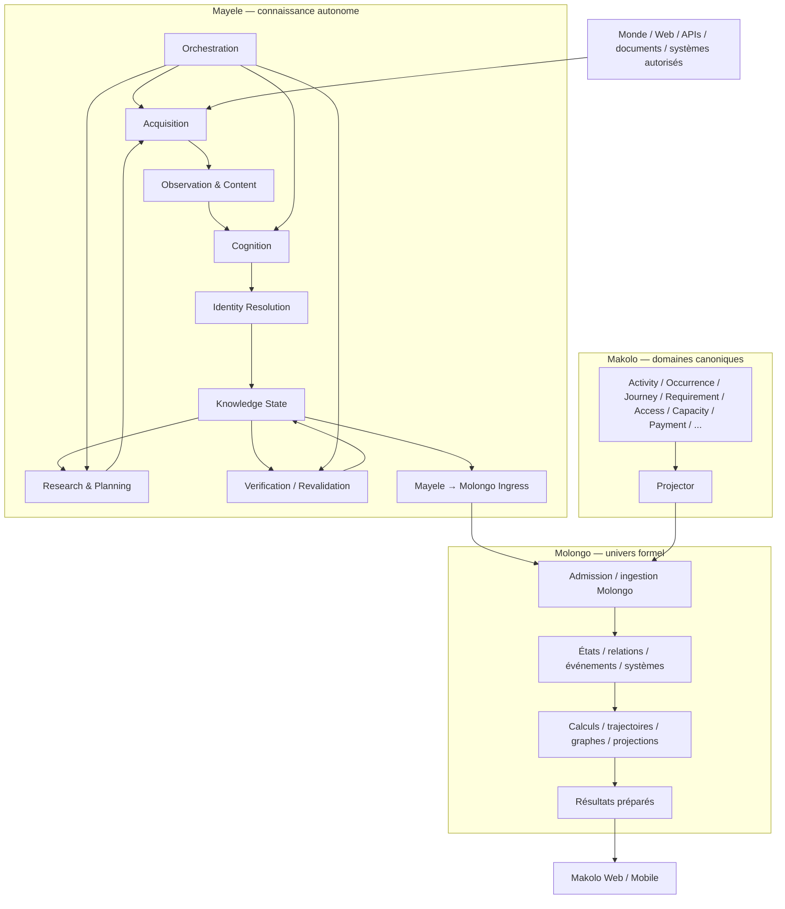

# Mayele — système autonome d’intelligence de Makolo
## Cadre architectural consolidé V2 — connaissance, autonomie et frontière avec Molongo

**Statut :** proposition de cadre architectural consolidé — étape 1 de la refondation Mayele  
**Date :** 30 septembre 2026  
**Dépôt de référence :** `TraditionLearningCommunity/makolo`  
**Base Git vérifiée pour l’audit runtime :** `main@0b2f626b5c93c03e74c5ff5afc7bf6bd4a9bf1d6`  
**Portée :** corriger et consolider l’architecture conceptuelle de Mayele à partir du cadre sémantique `MAYELE KNOWLEDGE RESEARCH V2` et de l’audit du runtime actuel, sans déplacer de modules, sans créer de tables, sans fixer prématurément le stockage ni les moteurs techniques.  
**Hors périmètre :** schémas Django finaux, migrations, structure physique définitive de `mayele/`, choix définitif PostgreSQL/Neo4j/R2, contrats réseau, API finales, déploiement de production, implémentation des agents et migration de l’ancien pipeline.

---

# 0. Pourquoi cette V2 existe

Le premier cadre Mayele a correctement posé trois idées majeures :

1. Mayele est autonome et travaille indépendamment d’une session utilisateur ;
2. Molongo est distinct de Mayele et de l’application Makolo ;
3. l’écosystème doit effectuer en amont un maximum de travail de recherche, compréhension, calcul et préparation.

Mais il est allé trop vite sur un point essentiel : il a assimilé une partie importante du pipeline technique existant — ResearchMission, Prospecteur, Observer, Interpreter, Resolver, Orchestration, Projector — à l’architecture canonique de Mayele.

L’audit du runtime actuel montre que cette assimilation n’est pas défendable telle quelle.

Les modules existants contiennent de nombreuses capacités utiles, mais ils n’ont pas tous la même nature :

- certains sont des mécanismes d’acquisition réutilisables ;
- certains appartiennent effectivement au futur Mayele ;
- certains mélangent plusieurs responsabilités qui doivent être séparées ;
- certains sont de l’infrastructure partagée ;
- certains constituent une frontière vers les domaines canoniques Makolo ;
- certains appartiennent plutôt à l’entrée de Molongo qu’au cœur de Mayele.

Cette V2 repart donc des responsabilités conceptuelles et du modèle de connaissance, puis repositionne l’existant comme matériau de migration.

Principe directeur :

```text
LE RUNTIME EXISTANT
!=
LA DÉFINITION DE MAYELE
```

Le runtime est audité à partir de Mayele ; Mayele n’est plus déduit automatiquement du runtime.

---

# 1. Vocabulaire de référence

Le projet distingue trois systèmes de nature différente.

| Nom | Sens retenu dans le projet | Responsabilité principale |
|---|---|---|
| **Makolo** | les pieds | application et système d’action qui accompagne la personne dans le réel |
| **Molongo** | l’univers | représentation formelle autonome et calculable des réalités pertinentes du monde |
| **Mayele** | l’intelligence / la sagesse | système autonome qui construit, entretient et qualifie la connaissance exploitable sur le monde |

La chaîne générale est :

```text
MONDE
  ↓
MAYELE
  ↓
CONNAISSANCE QUALIFIÉE
  ↓
MOLONGO
  ↓
CALCULS / PROJECTIONS
  ↓
MAKOLO
  ↓
ACTION RÉELLE
```

Cette chaîne n’implique pas que chaque information doit être copiée dans chaque couche.

Elle exprime des responsabilités.

Formulation de travail :

> **Mayele cherche, observe et établit ce que le système peut raisonnablement connaître.**  
> **Molongo représente et calcule un monde formel à partir d’entrées admissibles.**  
> **Makolo exploite les vérités métier et les résultats pertinents pour accompagner l’action réelle.**

---

# 2. Mayele : définition consolidée

> **Mayele est le système autonome d’intelligence et de construction de connaissance de l’écosystème Makolo.**
>
> Il découvre, acquiert, observe, lit, interprète, structure, rapproche, vérifie, historise, revalide et entretient une connaissance sourcée et réutilisable du monde nécessaire à l’action Makolo.
>
> Mayele ne cherche pas tout ce qui existe. Il travaille dans un espace de connaissance cadré par le monde d’action Makolo, ses verticales, ses relations structurantes et ses inconnues structurantes.
>
> Sa production principale n’est pas une réponse textuelle mais un **état de connaissance explicite**, capable de conserver ce qui est connu, inconnu, contradictoire, provisoire, daté, soutenu, révisé ou encore non résolu.
>
> Mayele peut ensuite proposer des entrées admissibles à Molongo sans devenir lui-même Molongo et sans devenir une seconde source de vérité pour les domaines métier Makolo.

Mayele est un système, pas un outil.

```text
MAYELE
!= Tavily
!= Exa
!= LLM
!= RAG
!= LangGraph
!= Temporal
!= Neo4j
!= PostgreSQL
!= R2
!= n8n
```

Ces briques pourront être employées pour implémenter certaines responsabilités, mais aucune d’elles ne définit l’architecture.

---

# 3. Autonomie

Mayele n’attend pas que quelqu’un ouvre Makolo pour commencer à travailler.

Invariant :

```text
UTILISATEUR CONNECTÉ
!=
MAYELE ACTIF
```

Mayele doit pouvoir travailler en arrière-plan sur des besoins connus, des connaissances incomplètes, des sources surveillées, des échéances de revalidation ou des changements détectés.

Ses modes fonctionnels peuvent inclure conceptuellement :

```text
DISCOVER
→ découvrir des réalités ou sources pertinentes encore inconnues

DEEPEN
→ approfondir une réalité déjà retenue mais incomplète

OBSERVE
→ acquérir effectivement le matériau d'une source

VERIFY
→ chercher soutien, contradiction, source primaire ou confirmation

WATCH
→ vérifier ce qui a changé depuis une observation antérieure

REVALIDATE
→ réévaluer une proposition sensible au temps

RESOLVE
→ rapprocher ou distinguer les identités

RESEARCH-GAP
→ rechercher une inconnue structurante identifiée par la connaissance ou par Molongo
```

Ces termes décrivent des modes de travail. Ils ne constituent pas encore des classes, tables, workers ou agents obligatoires.

---

# 4. Frontière sémantique : ce que Mayele cherche à connaître

Le cadre `MAYELE KNOWLEDGE RESEARCH V2` devient la référence sémantique de cette architecture.

Mayele ne construit pas une encyclopédie générale.

Il connaît explicitement six formes principales d’action :

```text
EVENT
TRANSPORT
SERVICE
OPPORTUNITY
FUNDING
OBTENTION
```

Il utilise une matrice commune pour comprendre ce qui compte autour de ces réalités :

```text
POSSIBILITY
OUTCOME
REQUIREMENT
EVIDENCE
ACTOR
AUTHORITY
SPATIOTEMPORAL
PROCEDURE
ACCESS
CAPACITY
ECONOMIC
OPERATIONAL
REFERENCE
```

Ces dimensions ne sont pas automatiquement des modèles ni des nœuds de graphe.

Mayele retient une réalité lorsqu’elle entre par au moins l’une des portes suivantes :

```text
1. instance candidate d'une verticale
2. réalité participant à une relation structurante
3. réalité nécessaire pour résoudre une inconnue structurante
```

La géographie et la pertinence personnelle ne constituent pas des frontières générales de connaissance.

```text
CONNAISSANCE COMMUNE
!=
PERTINENCE PERSONNELLE
```

Makolo contextualise ensuite ce qui compte pour une personne, un Espace, une démarche ou une situation.

---

# 5. Modèle sémantique de la connaissance

La correction structurante de cette V2 est de séparer le monde décrit de ce que Mayele affirme à propos de ce monde.

## 5.1 Structure décrite du monde

```text
Reality
Property
Relation
Condition
```

### Reality

Quelque chose qui mérite une identité propre et peut devenir le sujet d’autres connaissances.

### Property

Une caractéristique d’une réalité : attribut + valeur, éventuellement contextualisée dans le temps.

Exemples :

```text
deadline(Opportunity X) = 15 janvier
capacity(Event Y) = 120
price(Offer A) = 50 USD
```

### Relation

Un lien sémantiquement utile entre plusieurs réalités autonomes.

Exemples :

```text
Université X OFFERS Opportunity Y
Organisation A ISSUES Certificat B
Transport X ORIGIN Lubumbashi
```

### Condition

Une expression évaluable relativement à une situation.

Exemples :

```text
âge >= 18
TOEFL.score >= 90
posséder un passeport valide
paiement reçu avant la deadline
```

Une condition ne dit pas encore où elle s’applique.

---

## 5.2 Structure épistémique Mayele

```text
Proposition / Assertion
Knowledge Support
Proposition Assessment
Identity Resolution
Knowledge Completeness
```

### Proposition

Ce que Mayele affirme ou examine à propos du monde.

Elle peut porter sur :

```text
- l'existence d'une Reality
- une valeur de Property
- la tenue d'une Relation
- l'applicabilité d'une Condition
```

### Fact

`Fact` n’est plus une catégorie parallèle à Property, Relation ou Condition.

```text
FACT
=
PROPOSITION SUFFISAMMENT ÉTABLIE
DANS UN CONTEXTE ET UNE PÉRIODE DONNÉS
AVEC DES SUPPORTS CONSERVÉS
```

### Knowledge Support

Le support explique pourquoi une proposition est soutenue, contredite ou non résolue.

Il peut inclure :

```text
source
document
artefact
observation
page
passage
cellule
image
horodatage
provenance
version
contradiction
```

Invariant :

```text
CE QUE LA SOURCE DIT
!=
CE QUE MAYELE INTERPRÈTE
!=
CE QUE MAYELE CONSIDÈRE SUFFISAMMENT ÉTABLI
```

---

# 6. Trois dimensions à ne jamais confondre

Une erreur importante du futur modèle serait de réduire toute incertitude à un seul statut.

Mayele doit distinguer au moins :

```text
IDENTITY RESOLUTION
!=
KNOWLEDGE COMPLETENESS
!=
PROPOSITION ASSESSMENT
```

## Identity Resolution

Exemples conceptuels :

```text
RESOLVED
PROVISIONAL
UNRESOLVED
```

Une réalité peut exister dans la connaissance avant que son identité soit totalement résolue.

## Knowledge Completeness

Une réalité ou une facette peut être :

```text
KNOWN
PARTIALLY_KNOWN
UNKNOWN
CONTRADICTORY
NOT_APPLICABLE
```

## Proposition Assessment

Une proposition peut être :

```text
suffisamment établie
partiellement soutenue
contredite
non résolue
superseded / historiquement remplacée
```

Les statuts techniques exacts restent à définir dans une étape ultérieure.

Invariant :

```text
UNKNOWN
!= FALSE
!= NONE
!= CLOSED
!= NOT_APPLICABLE
```

---

# 7. Ce que Mayele reçoit du monde

Mayele ne reçoit jamais directement « la vérité du monde ».

Il reçoit des **manifestations observables** à travers des sources et systèmes.

Exemples :

```text
page Web
réponse API
PDF
DOCX
XLSX
email
message
image
fichier connecté
flux
base autorisée
système partenaire
```

Il faut donc distinguer :

```text
RÉALITÉ
!=
SOURCE
!=
DOCUMENT
!=
OBSERVATION
```

Une page peut disparaître sans que la réalité décrite disparaisse.

Une page peut être obsolète.

Deux sources peuvent décrire la même réalité.

Deux sources peuvent se contredire.

Une source peut être secondaire et simplement conduire Mayele vers une source plus autoritative.

---

# 8. Cycle conceptuel corrigé de construction de connaissance

L’ancien cycle imposait trop tôt :

```text
Validation
→ Admission canonique
→ Projection Molongo
```

Ce passage n’est plus universel.

Le cycle général de Mayele devient :

```text
SOURCE / SYSTÈME
      ↓
DÉCOUVERTE
      ↓
OBSERVATION
      ↓
ARTEFACT / CONTENU OBSERVÉ
      ↓
PASSAGE / ÉNONCÉ OBSERVÉ
      ↓
INTERPRÉTATION
      ↓
Reality / Property / Relation / Condition candidates
      ↓
PROPOSITION(S)
      ↓
KNOWLEDGE SUPPORT
      ↓
RÉSOLUTION D'IDENTITÉ
      ↓
ÉVALUATION ÉPISTÉMIQUE
      ↓
CONNAISSANCE MAYELE
```

À partir de là, plusieurs suites sont possibles.

### Boucle d’approfondissement

```text
CONNAISSANCE MAYELE
      ↓
UNKNOWN / CONTRADICTION / GAP
      ↓
NOUVELLE MISSION DE RECHERCHE
      ↓
NOUVELLE OBSERVATION
```

### Boucle temporelle

```text
CONNAISSANCE SENSIBLE AU TEMPS
      ↓
WATCH / REVALIDATION
      ↓
NOUVELLE OBSERVATION
      ↓
NOUVELLE VERSION / CONTRADICTION / CONFIRMATION
```

### Sortie vers Molongo

```text
CONNAISSANCE MAYELE
      ↓
CANDIDAT D'ENTRÉE MOLONGO
      ↓
CONTRAT D'ADMISSION MOLONGO
      ↓
REPRÉSENTATION MOLONGO
```

La forme précise du `MolongoInputCandidate` reste volontairement ouverte pour l’étape suivante.

---

# 9. Mayele n’est pas une seconde source de vérité métier

Les domaines Makolo restent propriétaires de leurs vérités.

Exemples :

```text
Activity
Occurrence
Journey
Requirement
Proof
Access
Capacity
Payment
Mandate
Permission
```

Mayele peut connaître des informations qui concernent ces concepts, mais il ne devient pas automatiquement leur owner.

Une information externe observée ne doit jamais produire silencieusement une mutation métier.

```text
OBSERVATION / PROPOSITION MAYELE
!=
VÉRITÉ CANONIQUE MAKOLO
```

Toute mutation d’un domaine propriétaire doit respecter son contrat, son autorité, ses permissions et ses règles d’admission.

Cette frontière est distincte de la construction générale de connaissance.

---

# 10. Correction majeure : deux voies vers Molongo

L’ancien cadre suggérait implicitement un chemin dominant :

```text
Mayele
→ admission canonique Makolo
→ Projector
→ Molongo
```

Ce chemin reste valable **pour les vérités métier appartenant effectivement aux domaines Makolo**.

Mais il ne peut pas être la seule voie.

Molongo doit aussi pouvoir représenter des réalités du monde que Makolo connaît sans avoir à fabriquer artificiellement une `Activity`, une `Organization`, une `Journey` ou un autre objet métier.

La cible conceptuelle devient donc :

```text
                 ┌──────────────────────────────┐
                 │ MONDE EXTERNE                │
                 └──────────────┬───────────────┘
                                ↓
                              MAYELE
                                ↓
                  connaissance externe qualifiée
                                ↓
                  MAYELE → MOLONGO INGRESS
                                ↓
                              MOLONGO
```

et parallèlement :

```text
DOMAINES CANONIQUES MAKOLO
          ↓
       PROJECTOR
          ↓
        MOLONGO
```

Ces deux chemins doivent converger dans Molongo sans fusionner leurs propriétaires.

### Conséquence

Mayele peut connaître une université, une réglementation, une route, une source institutionnelle, une qualification ou une réalité externe sans être obligé de créer une vérité métier Makolo fictive.

### Invariant

```text
CONNAISSANCE EXTERNE MAYELE
!=
VÉRITÉ MÉTIER CANONIQUE MAKOLO
```

Les deux peuvent être représentées dans Molongo avec une provenance différente et selon des règles d’admission différentes.

---

# 11. Rôle de Molongo dans cette architecture

Molongo reste un univers formel autonome.

Il ne doit pas être réduit :

```text
à Neo4j
à PostgreSQL
à un index
à un graphe de connaissance Mayele
au schéma Django
à une projection personnalisée
à un moteur de recommandation
```

Molongo représente des réalités, états, relations, conditions, événements, temps, trajectoires, systèmes et calculs selon ses propres cadres formels.

Mayele répond principalement à :

> **Qu’est-ce que nous savons, pourquoi le savons-nous, depuis quand et avec quelles limites ?**

Molongo répond principalement à :

> **Comment les réalités admises sont-elles représentées, reliées, situées et calculées dans l’Univers ?**

Makolo répond ensuite à :

> **Qu’est-ce qui compte maintenant pour cette action, ce Profile, cet Espace ou cette autorité ?**

---

# 12. Projections personnelles et connaissance commune

Mayele construit une connaissance réutilisable.

Il ne personnalise pas son univers de connaissance autour d’un seul Profile.

```text
UNIVERS DE CONNAISSANCE MAYELE
!=
PROJECTION PERSONNELLE
```

La personnalisation et la divulgation interviennent plus tard selon :

- le Profile ;
- le contexte ;
- la géographie ;
- les Interests ;
- les Veilles ;
- la Journey ;
- l’autorité ;
- les permissions ;
- la sensibilité ;
- la pertinence calculée.

Une donnée privée accessible à Mayele ne devient jamais automatiquement globale.

```text
ACCESSIBLE À MAYELE
!=
GLOBAL
!=
PUBLIC
!=
PARTAGEABLE
```

---

# 13. Responsabilités fonctionnelles de Mayele

La V2 conserve des blocs de responsabilité, mais retire toute équivalence automatique avec les anciens modules.

```text
MAYELE
│
├── Research & Planning
├── Acquisition
├── Observation & Content
├── Cognition
├── Knowledge
├── Identity Resolution
├── Verification & Revalidation
├── Orchestration
├── Connectivity
├── Observability
└── Molongo Ingress
```

## 13.1 Research & Planning

Responsabilité :

- formuler un besoin de connaissance borné ;
- exploiter la connaissance existante ;
- identifier une inconnue structurante ;
- construire une mission ;
- choisir les recherches pertinentes ;
- fixer critères d’arrêt, budgets et portée.

## 13.2 Acquisition

Responsabilité :

- Search ;
- Crawl ;
- découverte de sources ;
- connecteurs ;
- APIs ;
- index externes ;
- récupération de candidats.

## 13.3 Observation & Content

Responsabilité :

- acquérir le contenu réel ;
- préserver les artefacts ;
- tracer l’instant d’observation ;
- conserver transformations, empreintes et versions ;
- supporter HTML, API, PDF, images, documents, emails et autres contenus autorisés.

## 13.4 Cognition

Responsabilité :

- segmenter ;
- identifier passages et énoncés ;
- extraire mentions ;
- interpréter Reality / Property / Relation / Condition ;
- construire des propositions ;
- préserver modalité, négation, contexte, portée et temps ;
- distinguer extraction explicite et inférence.

## 13.5 Knowledge

Responsabilité :

- conserver les réalités connues ;
- propositions ;
- supports ;
- états épistémiques ;
- historique ;
- contradictions ;
- versions ;
- provenance ;
- lacunes de connaissance.

## 13.6 Identity Resolution

Responsabilité :

- déduplication ;
- aliases ;
- rapprochements ;
- distinction entre réalités homonymes ;
- conservation de l’incertitude ;
- identités provisoires ou non résolues.

## 13.7 Verification & Revalidation

Responsabilité :

- chercher les sources primaires ;
- croiser les sources ;
- conserver les contradictions ;
- vérifier la fraîcheur ;
- distinguer changement réel, correction, contexte différent et conflit ;
- planifier la prochaine revalidation lorsqu’elle est justifiée.

## 13.8 Orchestration

Responsabilité :

- exécuter des missions courtes ou durables ;
- coordonner workers et agents ;
- respecter budgets ;
- gérer retries ;
- timeouts ;
- idempotence ;
- reprises ;
- politiques d’arrêt ;
- priorités.

Cette orchestration est distincte de l’actuel module `orchestration/` qui traite surtout l’admission vers des owners métier.

## 13.9 Connectivity

Responsabilité :

- APIs directes ;
- connecteurs ;
- MCP lorsque pertinent ;
- OAuth ;
- permissions ;
- lecture / écriture séparées ;
- événements entrants.

## 13.10 Observability

Responsabilité :

- tracer la chaîne de connaissance ;
- coûts ;
- latence ;
- modèles utilisés ;
- outils ;
- erreurs ;
- décisions ;
- provenance technique ;
- qualité de l’extraction et des citations.

## 13.11 Molongo Ingress

Responsabilité :

- transformer la connaissance Mayele qualifiée en candidats d’entrée ;
- préserver temporalité et provenance nécessaires ;
- respecter les politiques d’admission Molongo ;
- déclencher les invalidations ou recalculs nécessaires après admission.

Cette responsabilité ne doit plus être confondue avec le Projector des domaines canoniques Makolo.

---

# 14. Positionnement du runtime actuel après audit

Le runtime existant reste précieux, mais devient une implémentation historique à réconcilier.

## 14.1 `intelligence/`

**Position : infrastructure partagée, pas cœur Mayele.**

Responsabilités actuelles utiles :

```text
provider registry
gateway
routage de modèles
capabilities
credentials
health
telemetry
```

Mayele peut l’utiliser, mais ne le possède pas conceptuellement.

---

## 14.2 `research_missions/`

**Position : concept Mayele à conserver et à refactoriser.**

À garder :

- mission bornée ;
- questions ;
- contexte connu ;
- unknowns ;
- origins ;
- raisons ;
- priorité ;
- scope ;
- limits.

À revoir : la taxonomie actuelle de familles de recherche, qui ne correspond plus entièrement à la matrice de connaissance V2.

---

## 14.3 `prospector/`

**Position : mécanismes d’acquisition largement réutilisables.**

À garder :

- frontier ;
- leases ;
- budgets ;
- checkpointing ;
- canonicalisation ;
- sécurité ;
- adapters de découverte ;
- feedback d’acquisition.

À corriger : la terminologie qui confond parfois evidence de découverte et support de connaissance.

Le nom Actor 1 ne doit plus structurer l’architecture cible.

---

## 14.4 `observer/`

**Position : très proche de la future couche Observation & Content.**

À garder largement :

- Observation ;
- ObservationAttempt ;
- ObservedArtifact ;
- ObservationMaterial ;
- content digest ;
- timestamps ;
- transformations ;
- revalidation.

Le futur travail portera surtout sur la liaison propre vers passage / énoncé observé / proposition.

---

## 14.5 `interpreter/`

**Position : capacité importante mais sémantique à refactoriser fortement.**

Le contrat actuel :

```text
ENTITY
FACT
RELATION
CONSTRAINT
```

n’est plus compatible avec la V2.

La cible conceptuelle est :

```text
Reality
Property
Relation
Condition
Proposition
Knowledge Support
```

Les mécanismes à sauver :

- parsing ;
- lecteurs ;
- CandidateValue ;
- spans ;
- pages ;
- grounding vers artefacts ;
- négation ;
- modalité ;
- conditions logiques ;
- enrichissement IA.

---

## 14.6 `resolver/`

**Position : à scinder conceptuellement.**

Le Resolver actuel mélange :

```text
A. résolution d'identité
B. matching vers objets Django canoniques
```
La cible devient :

```text
MAYELE IDENTITY RESOLUTION
→ appartient au cœur de la connaissance

CANONICAL DOMAIN MATCHING / ADMISSION
→ appartient à une frontière Mayele ↔ domaines Makolo
```

Une université peut être parfaitement résolue dans Mayele même si aucune `Organization` Django ne la représente.

---

## 14.7 `web_research/`

**Position : capacité de recherche à réutiliser, pas ontologie de Mayele.**

À garder :

```text
Discover
Deepen
Watch
provider-neutral search
budgets
freshness
stop reasons
```

À revoir :

- anciennes Research Families ;
- `DiscoveryKnownRef(domain, object_ref)` trop lié aux objets backend ;
- représentation de `fact-level evidence` à réconcilier avec Proposition / Knowledge Support.

---

## 14.8 `orchestration/`

**Position : frontière d’admission vers les owners métier, pas orchestration cognitive Mayele.**

Ce code protège utilement :

- source authority ;
- permissions ;
- represented Space ;
- transaction ;
- owner métier ;
- concurrence.

Il doit rester conceptuellement séparé de la future orchestration de recherche Mayele.

---

## 14.9 `projector/`

**Position : frontière Makolo canonique → Molongo.**

Il ne doit plus être présenté comme une sous-partie naturelle de Mayele.

```text
DOMAINE CANONIQUE MAKOLO
        ↓
    PROJECTOR
        ↓
     MOLONGO
```

Ce chemin coexiste avec le futur :

```text
CONNAISSANCE MAYELE
        ↓
MAYELE → MOLONGO INGRESS
        ↓
      MOLONGO
```

---

# 15. PR #366 : position de transition

La PR `#366 — Web Search Phase 7 — fact-level sourced evidence` reste ouverte au moment de cette consolidation.

Son branchement est aujourd’hui divergent par rapport à `main` et son vocabulaire `fact-level sourced evidence` précède la correction sémantique V2.

Elle ne doit donc pas être absorbée telle quelle comme définition de la connaissance Mayele.

Ce qu’il faut préserver conceptuellement :

- provenance au niveau de l’affirmation ;
- `source_refs` ;
- `observed_at` ;
- conservation des contradictions ;
- refus de sélectionner arbitrairement une source divergente ;
- validation des URLs réellement rapportées ;
- neutralité provider.

Ces mécanismes devront être réconciliés avec :

```text
Proposition
Knowledge Support
Proposition Assessment
Observation
```

avant intégration finale.

---

# 16. Technologies cibles : rôle, pas architecture

Les choix ou candidats technologiques déjà étudiés restent valables comme outils possibles :

```text
Tavily / Exa
LLM multi-provider
RAG
PostgreSQL
pgvector
R2
Neo4j / GDS
LangGraph
Temporal
n8n
MCP
OpenTelemetry
Prometheus
Loki
Tempo
Grafana
```

Mais le sens est désormais :

```text
RESPONSABILITÉ MAYELE
       ↓
CHOIX D'OUTIL
```

et jamais :

```text
OUTIL DISPONIBLE
       ↓
ONTOLOGIE MAYELE
```

### Exemples

```text
Tavily / Exa
→ acquisition / découverte

RAG
→ récupération de connaissance existante

LangGraph
→ certains graphes cognitifs

Temporal
→ workflows durables, timers, retries et reprises

Neo4j
→ projection graphe / analyse structurelle si utile

PostgreSQL
→ structures transactionnelles et historiques si retenu
```

Aucun de ces choix n’est encore la définition du modèle de données final.

---

# 17. Graphe Mayele et graphe Molongo

Le premier cadre laissait cette frontière ouverte ; elle doit le rester jusqu’au chantier de propriété des données.

Une distinction conceptuelle est néanmoins désormais nécessaire.

## Graphe de connaissance Mayele

Question principale :

> qui ou quoi Mayele connaît-il, quelle proposition est soutenue par quelle source, quelle identité est rapprochée, quelle contradiction existe, quelle version a remplacé quelle autre ?

Il peut contenir des structures telles que :

```text
Reality
Source
Observation
Proposition
Knowledge Support
Identity link
Contradiction
Version relation
```

## Graphe Molongo

Question principale :

> quelles réalités, états, relations, événements, systèmes, dépendances ou trajectoires appartiennent à l’Univers représenté et que peut-on calculer à partir d’eux ?

Ainsi :

```text
GRAPHE MAYELE
!=
GRAPHE MOLONGO
```

Même si, à terme, un même moteur physique pouvait éventuellement héberger plusieurs projections, cette proximité technique ne supprimerait pas la distinction conceptuelle.

---

# 18. Calculs, invalidation et précalcul

Le principe initial reste valable : Makolo ne doit pas attendre l’utilisateur pour tout recalculer.

Après une nouvelle connaissance admise dans Molongo :

```text
CHANGEMENT
  ↓
DÉPENDANCES AFFECTÉES
  ↓
INVALIDATION BORNÉE
  ↓
RECALCUL
  ↓
NOUVELLE VERSION DES RÉSULTATS
  ↓
SERVING
```

Mayele peut aussi recevoir des demandes de connaissance issues de Molongo :

```text
CALCUL MOLONGO
      ↓
INCONNUE / DONNÉE MANQUANTE
      ↓
MISSION MAYELE BORNÉE
      ↓
RECHERCHE / OBSERVATION / ÉVALUATION
```

Cette boucle doit être contrôlée par budgets, priorités et critères d’arrêt afin d’éviter des cycles auto-entretenus sans valeur.

---

# 19. Sécurité et confidentialité

Mayele peut accéder à des sources publiques et privées.

Invariant :

```text
DÉCOUVERT
!=
AUTORISÉ À ÊTRE STOCKÉ GLOBALEMENT
!=
AUTORISÉ À ENTRER DANS MOLONGO GLOBAL
!=
AUTORISÉ À ÊTRE SERVI À AUTRUI
```

Toute donnée doit conserver :

- provenance ;
- portée d’autorisation ;
- sensibilité ;
- finalité ;
- règles de rétention ;
- possibilité de révocation lorsque nécessaire.

Les agents n’héritent jamais implicitement des permissions d’un utilisateur ou d’un Espace.

Les domaines Makolo restent propriétaires des décisions d’autorité : Permission, Mandate, Access, Payment, Capacity et autres droits ne sont pas inférés par Mayele.

---

# 20. Invariants consolidés

1. **Mayele fonctionne indépendamment de la présence d’un utilisateur.**
2. **Mayele construit une connaissance du monde cadrée par l’action Makolo ; il ne cherche pas tout Internet.**
3. **Reality, Property, Relation et Condition sont distinctes.**
4. **Proposition appartient au niveau de connaissance ; Fact qualifie une proposition suffisamment établie.**
5. **Source, observation, interprétation et proposition établie restent distinctes.**
6. **Knowledge Support n’est pas Evidence métier.**
7. **Identity Resolution, Knowledge Completeness et Proposition Assessment ne sont pas le même axe.**
8. **UNKNOWN n’est jamais transformé silencieusement en FALSE.**
9. **Une réalité peut être retenue avant d’être complètement comprise ou résolue.**
10. **Objet et rôle contextuel restent distincts.**
11. **Mayele n’est pas une seconde source de vérité métier.**
12. **Les domaines Makolo gardent la propriété de leurs vérités canoniques.**
13. **Molongo n’est ni Mayele, ni Neo4j, ni PostgreSQL, ni Django.**
14. **La connaissance Mayele peut alimenter Molongo sans obligatoirement devenir d’abord une row métier Makolo.**
15. **Les vérités canoniques Makolo peuvent alimenter Molongo via Projector.**
16. **Ces deux voies d’entrée dans Molongo doivent conserver leur provenance et leur autorité d’origine.**
17. **La pertinence personnelle vient après la construction de connaissance commune.**
18. **Les données privées gardent leur portée et ne deviennent pas globales par composition.**
19. **Les outils et providers sont remplaçables ; ils ne définissent pas l’architecture.**
20. **Les calculs lourds doivent pouvoir être préparés hors du chemin critique utilisateur.**

---

# 21. Anti-features

Mayele ne doit pas devenir :

- un crawler généraliste sans bornes ;
- un clone de Google Search ;
- un data lake « au cas où » ;
- une encyclopédie universelle ;
- un graphe où chaque mot devient un nœud ;
- un graphe où chaque verbe devient une relation ;
- un système qui confond Property et Fact ;
- un système qui confond Observation et vérité ;
- un LLM qui écrit directement dans les domaines métier ;
- un moteur qui traite `UNKNOWN` comme `FALSE` ;
- une source d’autorité parallèle pour Permission, Mandate, Access, Capacity ou Payment ;
- une copie du backend Makolo ;
- un Molongo bis ;
- une architecture définie par Neo4j, Temporal, LangGraph ou un provider particulier ;
- une boucle multi-agent sans budget ni critère de sortie ;
- un système qui fait passer toute connaissance externe par une fausse entité métier pour atteindre Molongo.

---

# 22. Diagramme consolidé



Le diagramme est conceptuel. Il ne fixe ni les protocoles réseau, ni les bases physiques, ni le nombre de services.

---

# 23. Doctrine de migration

Cette V2 ne déclenche aucun déplacement automatique de code.

La migration suivra la règle :

```text
CONCEPT CORRIGÉ
      ↓
CONTRAT CIBLE
      ↓
AUDIT DU MODULE EXISTANT
      ↓
KEEP / REFACTOR / SPLIT / MOVE / RETIRE / OUTSIDE MAYELE
      ↓
MIGRATION PROGRESSIVE
```

Il est interdit d’appliquer simplement :

```text
mv prospector mayele/acquisition
mv interpreter mayele/cognition
mv resolver mayele/resolution
```

avant d’avoir corrigé les contrats et assuré la compatibilité des migrations, données et consommateurs.

Les anciennes tables, app labels et migrations doivent rester stables tant qu’une stratégie de transition n’est pas explicitement définie et testée.

---

# 24. Ce que cette étape fixe définitivement

À la fin de cette étape 1, nous considérons comme défendables :

```text
Makolo != Mayele != Molongo

Mayele = système autonome de construction et d'entretien de connaissance

Mayele Knowledge Research V2 = sémantique de référence

Reality / Property / Relation / Condition
!=
Proposition / Assessment / Support

Fact = proposition suffisamment établie

Mayele ne devient pas owner des vérités métier Makolo

Projector = chemin domaines canoniques Makolo → Molongo

Mayele aura sa propre frontière d'entrée vers Molongo

les anciens Actors/modules = implémentations à réconcilier, pas ontologie canonique
```

---

# 25. Ce qui reste ouvert pour l’étape 2

Le prochain chantier ne doit pas repartir dans un nouvel audit général.

Il doit répondre précisément à :

> **quels artefacts existent entre le monde observé et la connaissance Mayele, et quelles transformations permettent de passer de l’un à l’autre ?**

Il faudra fixer le contrat conceptuel de :

```text
Source
Discovery Result
Observation
Observed Artifact
Passage
Observed Statement
Mention
Reality Candidate
Property Candidate
Relation Candidate
Condition Candidate
Proposition
Knowledge Support
Identity Resolution
Proposition Assessment
Knowledge State
Research Gap
Molongo Input Candidate
```

Sans décider prématurément :

- table ou non ;
- PostgreSQL ou Neo4j ;
- LLM ou code déterministe ;
- agent ou worker ;
- sync ou async.

Une fois cette chaîne fixée, nous pourrons passer à l’étape 3 : propriété des données et persistance.

---

# 26. Formulation normative V2

> **Mayele est le système autonome d’intelligence et de construction de connaissance de l’écosystème Makolo. Il construit progressivement une connaissance structurée, sourcée, temporelle et réutilisable du monde nécessaire à l’action Makolo, indépendamment de la présence interactive d’un utilisateur. Cette connaissance distingue les réalités du monde, leurs propriétés, relations et conditions, des propositions épistémiques qui les décrivent et des supports qui permettent de les évaluer. Une proposition n’est qualifiée de fait que lorsqu’elle est suffisamment établie dans un contexte et une période donnés. Mayele conserve explicitement l’incertitude, la contradiction, l’identité provisoire, la fraîcheur et l’historique. Il ne devient jamais une seconde source de vérité pour les domaines métier Makolo. Les vérités canoniques restent possédées par leurs domaines et peuvent alimenter Molongo via Projector ; la connaissance externe qualifiée de Mayele peut, séparément, alimenter Molongo au travers d’une frontière d’admission dédiée. Molongo conserve sa propre responsabilité de représentation et de calcul, tandis que Makolo compose ensuite les vérités opérationnelles et les résultats préparés pour accompagner l’action réelle. Les providers, modèles IA, moteurs de recherche, bases de données, graphes et orchestrateurs sont des moyens remplaçables et ne définissent pas l’architecture.**

---

# 27. Formule synthétique

```text
MONDE
  ↓
MAYELE
  ├── cherche
  ├── observe
  ├── interprète
  ├── résout
  ├── vérifie
  ├── historise
  └── entretient la connaissance
        ↓
        ├──────────────→ MAYELE → MOLONGO INGRESS
        │                         ↓
        │                       MOLONGO
        │                         ↓
        │                      CALCULS
        │                         ↓
        │                      SERVING
        │                         ↓
        └──────────────────────→ MAKOLO

DOMAINES CANONIQUES MAKOLO
        ↓
     PROJECTOR
        ↓
      MOLONGO
```

Le principe ultime reste :

> **Mayele ne cherche pas tout ce qui existe. Il entretient ce qu’il faut raisonnablement connaître du monde pour que Molongo puisse le représenter et le calculer, et pour que Makolo puisse accompagner l’action réelle avec le maximum de travail déjà préparé.**